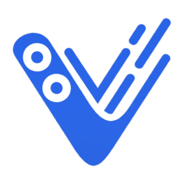

<p align="center">
  
</p>

<h1 align="center">VOLO</h1>
<p align="center">
  <strong>The Future of Portfolio Building</strong><br>
  <em>A high-performance engine for creating cinematic, production-ready portfolios in minutes.</em>
</p>

---

## 📅 Project Timeline
**October 2025 – April 2026**
*Developed as a premium tool for creators to bridge the gap between design and deployment.*

<p align="center">
  
  
  
  
</p>

---

## 📌 Project Overview
**VOLO** is a sophisticated portfolio builder designed with a focus on speed, aesthetics, and user autonomy. It allows developers and designers to bypass the complexity of modern build tools, offering a seamless "Launch to Export" workflow. The platform features real-time previewing, dynamic theming, and a high-performance ZIP export system.

## 🎯 Engineering Excellence & Metrics
VOLO is built with a focus on measurable success. Every portfolio generated is validated against the following industry-standard metrics:

### 1. Technical Performance (Verification)
*   **Core Web Vitals**: Targetting 100/100 Lighthouse scores.
    *   **LCP (Largest Contentful Paint)**: Optimized asset loading for < 1.2s.
    *   **INP (Interaction to Next Paint)**: Ensuring high responsiveness.
    *   **CLS (Cumulative Layout Shift)**: Zero layout jumping via pre-defined aspect ratios.
*   **Time to Interactive (TTI)**: Minimal JS execution time for instant usability.

### 2. Usability & Accessibility (Validation)
*   **Task Success Rate (TSR)**: Aiming for 100% success in the "Launch to Export" workflow.
*   **WCAG Compliance**: Verification against AA/AAA levels for inclusive design.
*   **System Usability Scale (SUS)**: Benchmarking perceived ease-of-use.
*   **Learnability**: Designing for zero-curve proficiency.

### 3. Business & Engagement
*   **Conversion Rate (CR)**: Optimizing generated CTAs to drive visitor action.
*   **Bounce Rate Reduction**: Using cinematic UI to increase "Dwell Time."
*   **Retention Rate**: Persistent drafting via LocalStorage to encourage return visits.

---

## 🛠️ Key Competencies
*   **System Architecture**: State-driven real-time preview engine with local persistence.
*   **UI/UX Design**: Cinematic glassmorphism, parallax effects, and visual hierarchy.
*   **Template Engineering**: Reusable Handlebars-based component systems.
*   **Performance Optimization**: Critical CSS pathing and optimized asset delivery.
*   **Data Management**: Client-side binary generation and complex state handling.

---

## ✨ Key Features
- **Cinematic Templates**: Professionally designed, responsive layouts with parallax and glassmorphism.
- **Real-time Engine**: Instant visual feedback as you modify your professional story.
- **One-Click Export**: Generates a production-ready, SEO-optimized ZIP package.
- **Accessibility First**: Automated color contrast checks and screen-reader friendly structures.
- **Dynamic Theming**: Support for 16+ theme colors and persistent Dark/Light modes.

---

## 🛠️ Tech Stack

| Layer | Technology |
| :--- | :--- |
| **Core Logic** | JavaScript (ES6+), Handlebars.js |
| **Styling** | Tailwind CSS (JIT Engine) |
| **File Handling** | JSZip, File API |
| **Assets** | Google Fonts (Plus Jakarta Sans), Lucide Icons |

---

## 📁 Project Structure
```text
volo-portfolio-builder/
├── assets/           # Brand assets, custom cursors, and icons
├── templates/        # Core builder templates (Handlebars-driven)
├── app.js            # Main application state and rendering logic
├── index.html        # Interactive landing page
└── README.md         # Documentation
```

## How to Use
1. Open `index.html` in your browser to view the VOLO Home Page.
2. Click **Launch Builder** to open the `template1.html` tool.
3. Fill in your professional details in the sidebar.
4. Click **Download** to export your production-ready portfolio.

---

## 👤 Author & Contact
**Pawan Simha R**
- **Email**: iampawansimha.2004@gmail.com
- **GitHub**: @PawanSimha

## License
GNU GPL v3.0
