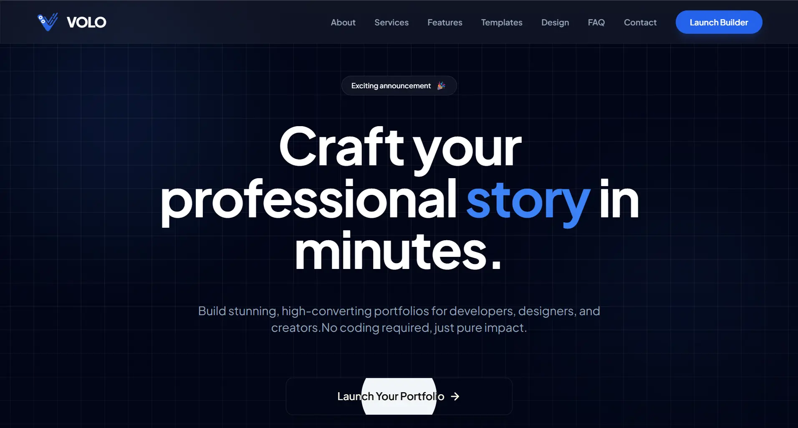

<p align="center">
  
</p>

<h1 align="center">VOLO · Portfolio Builder</h1>

<p align="center">
  <em>The Future of Portfolio Building. A high-performance engine for creating cinematic, production-ready portfolios in minutes.</em>
</p>

<p align="center">
  
  
  
  
  
  
</p>

<p align="center">
  
</p>

---

## Product Strategy

### Problem

Building a professional portfolio is either a tedious coding exercise or a generic drag-and-drop experience that sacrifices uniqueness. Developers lose time wiring up frameworks; designers lose control over the final output. No tool exists that gives both **creative freedom** and **production-grade output** without requiring a build toolchain.

### Solution

VOLO is a **zero-config, client-side portfolio engine** that treats every output as a **production-grade artifact**:

- A real-time preview renders every edit instantly via Handlebars compilation — no servers, no builds, no refreshes.
- One-click ZIP export generates a fully self-contained, SEO-optimized, responsive portfolio ready for any static host.
- 16 theme colors, persistent dark/light modes, and reusable templates give users **design-system-grade control** in a browser.
- State is persisted via LocalStorage, enabling session recovery and iterative editing.

The result is a **launch-to-export workflow** that collapses hours of boilerplate into minutes of intentional crafting.

### Design Philosophy - Cinematic Minimalism

A dark-first glassmorphism aesthetic with electric blue (`#3b82f6`) accents, parallax stacking sections, draggable image playgrounds, tilt-card effects, and zero external animation libraries. Every interaction (spotlight buttons, parallax scroll dissolves, card tilts) feels intentional without being heavy.

### Performance-First Architecture

All processing is client-side. Templates render via Handlebars, styling via Tailwind CDN (JIT), and ZIP exports via JSZip — zero server roundtrips. The landing page features CSS-native parallax stacking with GPU-accelerated transforms for 60fps scroll effects.

---

## Key Features

### Frontend & Interaction

| Capability | Details |
|---|---|
| **Real-Time Preview** | Sidebar edits instantly re-render the portfolio via Handlebars compilation |
| **Cinematic Landing Page** | Parallax stacking sections with scroll-driven scale/blur/fade transitions |
| **Draggable Image Playground** | 8 interactive photos with mouse/touch drag; z-index stacking on interaction |
| **Tilt Card Effects** | 3D perspective rotation on service cards tracked via mouse position |
| **Spotlight Button** | Mouse-following radial highlight on primary CTA |
| **Custom Cursors** | Branded Arrow.ico and Hand.ico cursors for links/interactive areas |
| **Mobile Adaptive** | Hamburger overlay menu with smooth slide transitions |
| **FAQ Accordion** | Accessible expand/collapse with grid-based row animation |

### Builder Engine

| Capability | Details |
|---|---|
| **Dynamic Data Model** | 16-field state object covering bio, skills, projects, education, experience, awards, certs, contact links |
| **Handlebars Templating** | Reusable template string with 10+ custom helpers (trunc, formatDate, initials, longDesc, eq, gt, or) |
| **16 Theme Colors** | Blue, Indigo, Purple, Rose, Emerald, Amber, Teal, Slate, Cyan, Sky, Violet, Fuchsia, Pink, Lime, Orange, Red |
| **Dark/Light Mode** | Persistent toggle with Tailwind `dark:` class switching on the iframe preview |
| **ZIP Export** | Generates a complete self-contained portfolio using JSZip — HTML, embedded styles, and images |
| **LocalStorage Persistence** | Full state recovery across sessions for uninterrupted editing |

### Content Sections (Generated Portfolio)

| Section | Description |
|---|---|
| **Header** | Avatar initials badge, name, title, bio, CTA, LinkedIn, stats counter |
| **About** | Italic quote-styled personal summary |
| **Skills** | Technical + soft skill tags with hover elevation effects |
| **Projects** | Card grid with date badges, truncation, "Show All" expansion |
| **Education** | Level/school/grade cards with date formatting |
| **Experience** | Event timeline with optional images, truncation |
| **Awards** | Honors grid with image support |
| **Certifications** | 4-column grid with hover zoom and error fallback |
| **Contact** | Email + WhatsApp direct links with branded icons |
| **Footer** | Navigation, social links, resume download, availability badge |

---

## Visual Architecture

```
+--------------------------------------------------------------------+
|                        Landing Page (index.html)                    |
|  (Navbar · Hero · 4x Parallax Stack · About Stats · Services ·    |
|   Drag Playground · Features · Logo Design · FAQ · Contact · Footer) |
+--------------------------------------------------------------------+
|                                                                      |
|   +------------------------------------------------------------+   |
|   |                 Builder (templates/template1.html)         |   |
|   |  +-------------------+  +--------------------------------+ |   |
|   |  | Sidebar (Inputs)  |  | Preview (Iframe)                | |   |
|   |  |  - Personal Info  |  |  Handlebars-compiled HTML       | |   |
|   |  |  - Skills         |  |  Live re-render on every keystroke| |   |
|   |  |  - Projects       |  |  16 theme colors · Dark/Light    | |   |
|   |  |  - Education      |  |  ZIP export via JSZip           | |   |
|   |  |  - Experience     |  +--------------------------------+ |   |
|   |  |  - Awards/Certs   |                                      |   |
|   |  |  - Contact        |                                      |   |
|   |  +-------------------+                                      |   |
|   +------------------------------------------------------------+   |
+--------------------------------------------------------------------+
|  builder.html  →  Template selection gallery (template1.html)       |
+--------------------------------------------------------------------+
```

---

## Tech Stack

| Layer | Technology |
|---|---|
| **Core Logic** | JavaScript (ES6+) |
| **Templating** | [Handlebars.js](https://handlebarsjs.com) (runtime compilation) |
| **Styling** | [Tailwind CSS](https://tailwindcss.com) (CDN JIT mode) |
| **File Export** | [JSZip](https://stuk.github.io/jszip/) |
| **Fonts** | Plus Jakarta Sans (via Google Fonts) |
| **Icons** | SVG inline (Lucide-style) |
| **State** | LocalStorage (session-persistent) |

---

## Project Structure

```
VOLO-New/
├── assets/
│   ├── icons/                    # Custom cursor files (Arrow.ico, Hand.ico)
│   └── images/                   # Brand assets (logo.png, favicon.ico)
├── templates/
│   └── template1.html            # Main builder — sidebar + live preview + export
├── app.js                        # Handlebars helpers, state, render, CRUD, ZIP export
├── builder.html                  # Template selection / launch gallery
├── index.html                    # Marketing landing page (parallax, drag, services, FAQ)
├── LICENSE                       # GNU GPL v3.0
├── README.md                     # Documentation
└── volo.webp                     # README hero image
```

---

## Quick Start

### Prerequisites

- A modern browser (Chrome, Firefox, Edge, Safari) — no build tools required.

### Installation

```bash
# 1. Clone the repository
git clone https://github.com/PawanSimha/volo.git
cd VOLO-New

# 2. Serve locally (choose one)
npx serve .              # via serve
python -m http.server    # via Python
```

Open [http://localhost:3000](http://localhost:3000) (or the port your server provides).

### Usage

```bash
# 1. Open index.html — explore the marketing landing page
open index.html

# 2. Click "Launch Builder" — or open templates/template1.html directly
# 3. Fill in your details in the sidebar
# 4. Export your production-ready portfolio as a ZIP
```

---

## Product Roadmap

- [ ] **Additional Templates** — Expand beyond template1 with 3–5 distinct layouts (minimal, bold, academic)
- [ ] **Image Upload for Preview** — Enable local image selection for profile/portfolio visuals
- [ ] **Custom CSS Injection** — Allow advanced users to inject overrides before export
- [ ] **Multi-language Export** — Generate output with i18n-ready structure
- [ ] **Live Github Stats** — Fetch real contribution/commit counts via GitHub API

---

## Developer Experience

### Extending Templates

The builder template lives in `templates/template1.html`. The Handlebars template string is defined in `app.js:76-582`. To customize:

1. Edit the HTML structure inside the `` `...` `` template literal
2. Use existing helpers (`{{formatDate}}`, `{{trunc}}`, `{{initials}}`, etc.) defined in `app.js:1-42`
3. Add new helpers via `Handlebars.registerHelper(name, fn)` before the template string
4. Extend the `portfolioData` state object (line 44) for new fields

### Troubleshooting

| Issue | Likely Cause | Fix |
|---|---|---|
| `Handlebars is not defined` | CDN not loaded | Check network tab; verify `https://cdn.jsdelivr.net/npm/handlebars@latest` loads |
| `JSZip is not defined` | JSZip CDN missing | Add `<script src="https://cdn.jsdelivr.net/npm/jszip/dist/jszip.min.js">` |
| Preview not updating | State not saved | Check `save()` calls; verify LocalStorage is not full |
| ZIP download fails | File/Blob API unsupported | Use a modern browser (Chrome 90+, Firefox 90+, Edge 90+) |
| Parallax not animating | Scroll container mismatch | Verify `#parallax-trigger` elements exist in DOM on load |

### Contribution

This is a personal project, but contributions, forks, and adaptations are welcome. Open an issue or PR on the [GitHub repository](https://github.com/PawanSimha) for:

- New template designs
- Performance improvements
- Accessibility enhancements

---

## License

Distributed under the **GNU GPLv3 License**. See `LICENSE.md` for more information.

---

## Links

| Platform | URL |
|----------|-----|
| **GitHub** | [github.com/PawanSimha](https://github.com/PawanSimha) |
| **LinkedIn** | [linkedin.com/in/pawansimha](https://www.linkedin.com/in/pawansimha) |
| **X / Twitter** | [x.com/pawansimha](https://x.com/pawansimha) |
| **Google Developer** | [g.dev/pawansimha](https://g.dev/pawansimha) |

---

<p align="center">
  <b>Pawan Simha R</b>
  <br />
  <sub>Built with HTML5 · JavaScript ES6+ · Tailwind CSS · Handlebars.js</sub>
</p>
